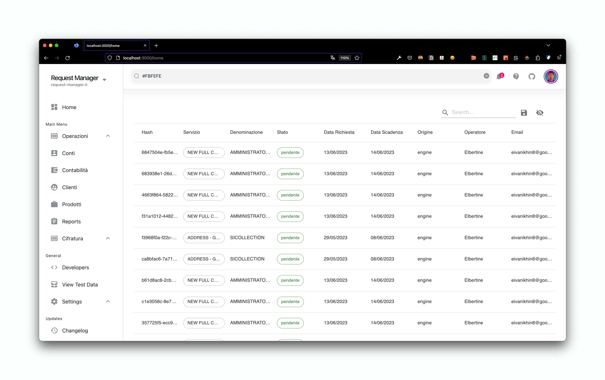

# Gestione Richieste

- Funziona come elenco di lavorazione di un operatore, con funzionalità limitate.
- Funzionalità di assegnare step di lavorazione manuale a qualsiasi suo (collegato alla entità) operatore.

TODO: add pictures and descriptions
